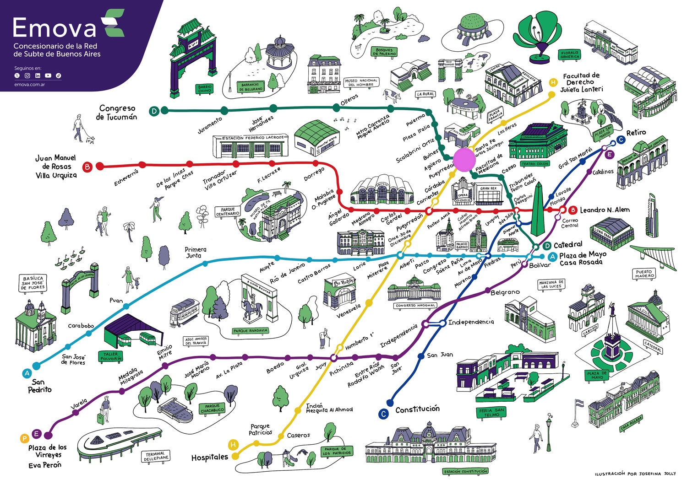
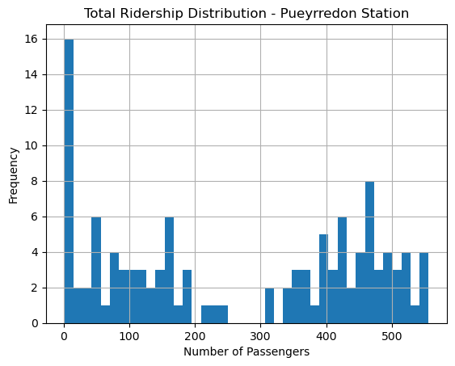
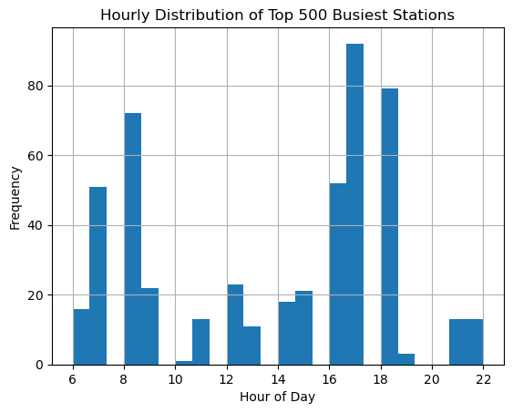
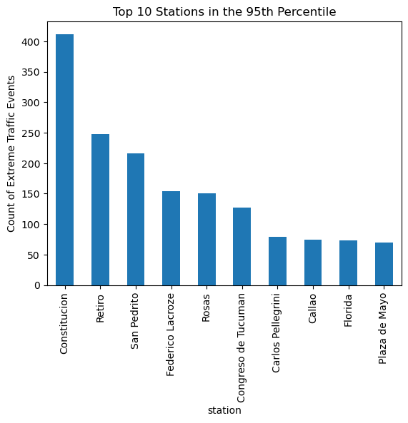

# 🚉 Urban Mobility: Buenos Aires Subway Ridership Analysis

## 📌 Project Overview

This project investigates public transportation accessibility and efficiency in Buenos Aires, Argentina. Using Python and the **pandas** library, the analysis identifies peak usage patterns, defines high-traffic thresholds using statistical quantiles, and compares performance across the city's subway network (*Subte*).

The analysis is divided into three distinct phases: **Data Structures**, **Sorting & Filtering**, and **Descriptive Statistics**.

---

    

    <a href="https://emova.com.ar/wp-content/uploads/2023/09/Mapa_Emova_2023-color-.jpg">image source</a>

---

## 🏗️ Part 1: Data Structures

The foundation of the project focuses on the **Pueyrredón Station (Line D)**, establishing the move from manual grid management to high-performance data manipulation.

* **Step 1: Data Ingestion:** Importing raw CSV data into a **Pandas DataFrame**. This leverages **vectorized operations**, allowing for mathematical calculations across the entire dataset simultaneously.

* **Step 2: Dataset Inspection:** Utilizing methods like `.info()` and `.describe()` to perform a data audit, ensuring type consistency and identifying any null values.

* **Step 3: Feature Selection:** Simplifying the dataset by selecting specific columns (`datetime`, `pax_total`, etc.) and removing redundant features to optimize memory usage.

* **Step 4: Distribution Analysis:** Generating a histogram of total passenger counts.
  * **Strategic Logic:** Setting `bins=24` creates a visual "pulse" of the day. This reveals a **skewed distribution**, showing that while the station is quiet most of the time, it handles intense, short-lived spikes during commute hours.

#### Ridership Distribution

#### Summary of Histogram:
  * **Purpose:** The chart shows that most recorded hours had relatively low passenger counts (tall bars on the left), while high-traffic peak moments were much less frequent. It groups the number of passengers into ranges (called **bins**) to show the overall distribution of ridership rather than individual data points.
  * **X-Axis (Horizontal):** Represents the **volume of passengers** per hour. The left side shows low numbers (quiet periods), and the right side shows high numbers (rush hour).
  * **Y-Axis (Vertical):** Represents the **frequency**, or how many hours in the dataset fell into those specific passenger ranges.
  * **The Findings:** The chart typically shows a **skewed distribution**. This means that most recorded hours had relatively low passenger counts (tall bars on the left), while the high-traffic peak moments were much less frequent (short bars on the right).

---

## 🔍 Part 2: Sorting and Filtering

In this phase, we expand the analysis to the entire city network to identify where resources—such as train cars and security—are most needed.

* **Step 1: Global Sorting:** Ranking the dataset by `line` and `pax_TOTAL` to instantly surface the most congested segments of the network.

* **Step 2: Sub-Line Filtering:** Isolating **Line E** to perform a deep-dive analysis on its specific traffic patterns.

* **Step 3: Data Slicing:** Reducing the dataset to the **Top 500 records** to focus exclusively on "Peak Load" events.

* **Step 4: Rush Hour Identification:** Plotting the `hour` feature for the busiest subset.
  * **The Insight:** The analysis identified a critical afternoon rush window between **16:00 and 18:00**, pinpointing 6 specific stations that require the most attention during these hours.

#### Peak Traffic by Hour

#### Summary of Histogram:
  * **Purpose:**  By focusing on the top 500 records, we identify the specific times of day that consistently produce the highest passenger volumes.
  * **X-Axis (Horizontal):** Represents the **hour of the day** (from 0 to 23). By using **24 bins**, each bar represents exactly one hour of a full day cycle.
  * **Y-Axis (Vertical):** Represents the **frequency** of extreme events. It counts how many times a specific hour appeared in the list of the 500 most crowded records.
  * **The Findings:** The chart typically reveals **Bimodal Peaks**. You will see two distinct tall bars or "humps"—one in the morning (around 8:00 AM) and one in the late afternoon (between 16:00 and 18:00). This confirms the standard commuter "Rush Hour" pattern.

---

## 📊 Part 3: Descriptive Statistics

The final phase models the system's behavior under "extreme conditions" to help stakeholders plan for the highest possible demand.

* **Step 1: Quantile Filtering:** Using `.quantile(0.95)` to define "Extreme Traffic."
  * **Strategic Logic:** Infrastructure is built for peak capacity, not averages. This isolates the top 5% of all traffic events in the month.

* **Step 2: Descriptive Statistics:** Calculating the `mean`, `median`, `standard deviation`, and `maximum` for the high-traffic subset (`df_95q`) to quantify the stress on the network.

* **Step 3: Plotting Station Counts:** Generating a bar chart of the stations most frequently appearing in the 95th percentile. This identifies which stations are the "consistent outliers" in the system.
  * **The Findings:** This chart highlights the **Critical Hubs**. Even if many stations are busy, a few specific stations (like Constitución) will have significantly taller bars. This tells stakeholders exactly where to prioritize physical infrastructure upgrades, such as wider platforms or additional turnstiles.

#### Top Station Analysis

#### Summary of Histogram:
  * **Purpose:** It isolates the stations that most frequently exceed the **95th percentile ridership threshold**.
  * **X-Axis (Horizontal):** Lists the **Subway Stations**. Usually, this is limited to the "Top 10" to keep the visual clear and actionable.
  * **Y-Axis (Vertical):** Represents the **event count**. It shows how many times that specific station experienced a "95th percentile" traffic event during the month.

* **Step 4: Statistics per Station:** Calculating the mean ridership segmented by individual station to identify the average "peak load" per location.

* **Step 5: Multi-Feature Segmentation (Pivot Tables):** Utilizing `pivot_table()` to compare **Hour** vs. **Subway Line**.
  * **The Discovery:** This revealed that while most lines follow a standard workday curve, **Line E** encounters high passenger counts well into the night (hours 21 and 22), identifying a unique demographic of late-night commuters.

| hour | A | B | C | D | E | H |
| --- | --- | --- | --- | --- | --- | --- |
| 5 | nan | nan | 1738.74 | nan | nan | nan |
| 6 | 1281.29 | 1296.31 | 5499.08 | nan | nan | nan |
| 7 | 1866.11 | 2807.43 | 5617.16 | 2317.27 | 1423.5 | 1918.88 |
| 8 | 1863.7 | 2611.43 | 6060.87 | 2534.12 | 1397.31 | 1740.25 |
| 9 | 1675.23 | 2120.98 | 4246.31 | 1864 | nan | 1315.36 |
| 10 | 1391.35 | 1378.29 | 2690.5 | 1362.75 | nan | nan |
| 11 | 1432.29 | 1312.25 | 2639.86 | 1309.38 | 1835 | nan |
| 12 | 1573.41 | 1324.88 | 2192.37 | 1536.67 | 2023.54 | nan |
| 13 | 1710.46 | 1350.28 | 2507.52 | 1436.3 | nan | nan |
| 14 | 1484.47 | 1216 | 2156.58 | 1296 | nan | nan |
| 15 | 1420.22 | 1298.1 | 2047.02 | 1556.57 | 1357.67 | nan |
| 16 | 1608.28 | 1428.19 | 2303.65 | 1713.17 | 1463.85 | 1275.6 |
| 17 | 1935 | 1620.21 | 2274.91 | 1953.74 | 1653.2 | 1276.73 |
| 18 | 1712.04 | 1515.16 | 2025.16 | 1684.82 | 1405.47 | 1264.89 |
| 19 | 2372.67 | 1392.33 | 1522.82 | 1445.33 | nan | nan |
| 20 | 1689.5 | 1273 | 1315.08 | 1224 | nan | 1275 |
| 21 | nan | nan | nan | 1560 | 1570.71 | nan |
| 22 | nan | nan | nan | nan | 1333.5 | nan |

---

## 🛠️ Technical Competencies Demonstrated

* **Vectorized Data Operations:** Improving performance over basic Python lists.
* **Statistical Thresholding:** Identifying peak loads via quantiles.
* **Multi-Dimensional Analysis:** Segmenting data through `.groupby()` and `.pivot_table()`.
* **Data Visualization:** Using histograms and bar charts to translate raw logs into actionable urban insights.

---

## 🧠 Strategic Takeaway: The "Hidden State"

This project demonstrates a professional transition from the visible grids of spreadsheets to managing a program's **Hidden State**. By leveraging the memory of the computer, I can process millions of rows at high speeds, maintain a traceable "audit trail" of all transformations, and build scalable tools applicable to any urban transit system worldwide.

---

## 🚀 How to Run

1. Clone this repository.
2. Install dependencies: `pip install pandas matplotlib`.
3. Open `Buenos Aires Subway.ipynb` and run the cells sequentially.

---

### Author

*Data Analyst | Former EdTech Co-Founder*

* **7+ Years** of experience in business operations, strategic growth, and entrepreneurial leadership.
* I specialize in bridging the gap between raw data and **high-stakes business decisions**.
* My goal is to help organizations move beyond "gut feeling" to drive growth through evidence-based strategy.

### 🔗 Connect with me: [LinkedIn](https://www.linkedin.com/in/ayushi-gajendra/)
